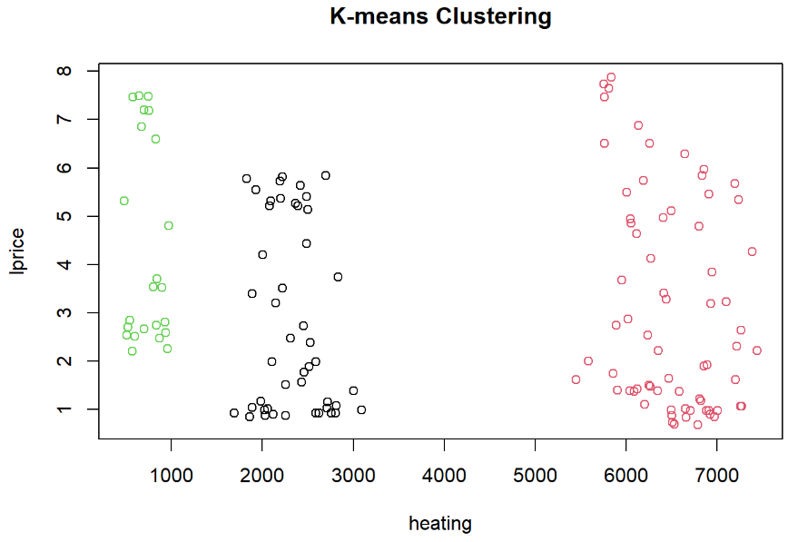
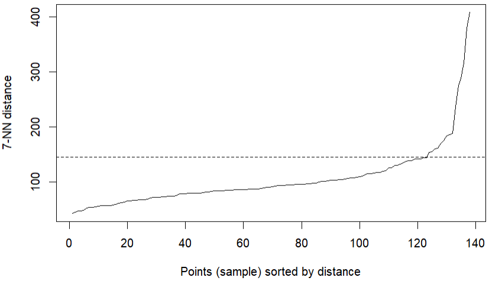
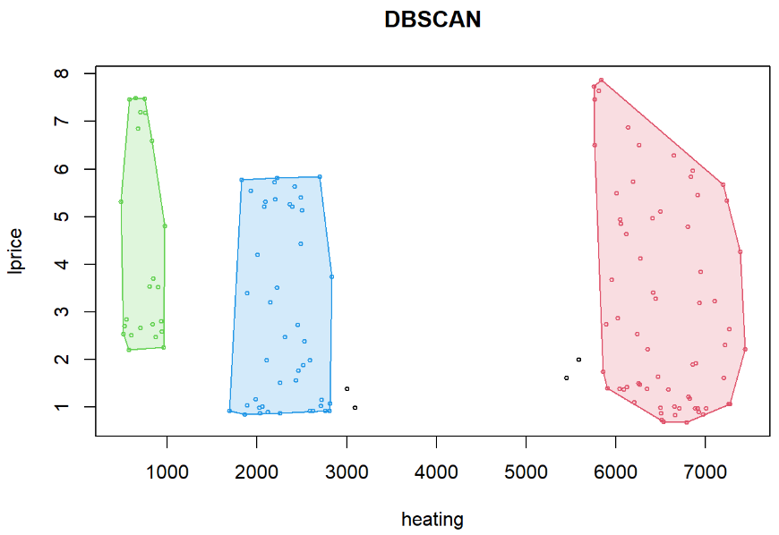

# Clustering NaturalGas dataset
K-means and DBSCAN clustering of NaturalGas dataset in R

## Dataset
The Natural Gas Data, described as “panel data originating from 6 US states over the period 1967-1989” was retrieved June 25, 2022, from an [R repository](https://vincentarelbundock.github.io/Rdatasets/datasets.html).

The dataset has 138 observations over 10 variables.  For simplicity, the cluster analysis focuses on the `heating` and `lprice` variables.  The `heating` variable refers to heating degree days.  The `lprice` variable is the price of liquefied petroleum gas.  There are roughly three clusters to the naked eye.

## K-Means

## DBSCAN

With k = 7, the optimal eps value is 146.

## Conclusion
Both methods found the natural shape of the clusters.  It should be noted, however, that these shapes were relatively straightforward; there were no nested structures and each cluster was globular, so the algorithms performed well in their own respects.  The larger scale of the `heating` variable in comparison to the `lprice` variable helped separate the clusters for the k-means algorithm.

## Reference
Baltagi, B. H. (2002). *Econometrics* (3rd ed.). Springer. Retrieved June 25, 2022, from [https://vincentarelbundock.github.io/Rdatasets/datasets.html ](https://vincentarelbundock.github.io/Rdatasets/datasets.html)

## License
MIT
